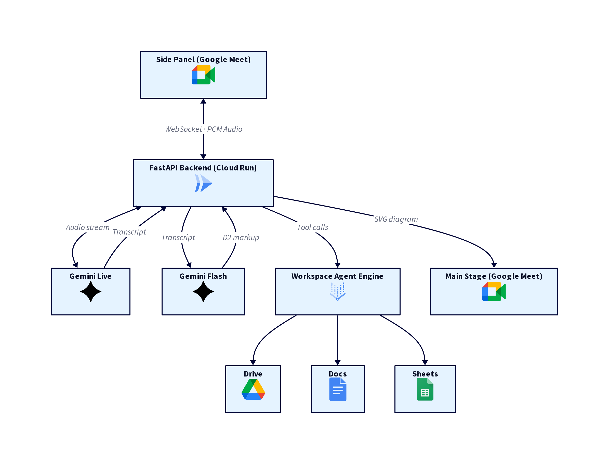

# Google Meet Architecture Agent Add-on

*If at first you don't succeed, build a better AI pipeline.*

Back in February I set out to connect Google Meet to Gemini and build a meeting concierge with a few useful features. After a lot of small victories I got close to a working proof-of-concept, but couldn't maintain a stable WebSocket connection at the final mile. I shelved it.

I'd nearly forgotten about it until I saw a post from [Pierrick Voulet](https://www.linkedin.com/in/pierrickvoulet/), a prolific Google Developer, who had managed to get the pattern working thanks to some creative prompting and Anti Gravity. That was all the motivation I needed.

I jumped back in last week, spent most of a weekend refining it, and got it to a point I think is worth sharing.

---

## What it does

### 🎙️ Voice Concierge
Hears all meeting participants via the Meet Media API and responds by voice using Gemini Live.

### 📐 Architect Mode
Converts spoken architecture discussion into real-time D2 diagrams, rendered live on the Meet main stage for all participants.

### 🎛️ Advanced View Layouts
Rearrange the stage dynamically with `single`, `split`, and `grid` layouts to view terminal sessions, diagrams, notepad, and docs concurrently.

### 🖌️ Interactive Drawings & Laser Dot
Highlight details with a resolution-independent pulsing laser pointer or draw directly on a transparent stage overlay.

### 🤝 Collaborative Markdown Notepad
Interactive, live-updated markdown notepad widget supporting text append or overwrite directly from CLI or API.

### 💻 Local Terminal Streaming
Stream stdout and stderr of local shell commands live into the Meet stage for real-time demonstration or collaborative debugging.

### 💼 Workspace Agent
Voice-activated creation of Google Docs and Sheets, Drive search, and Calendar lookup — acting as the signed-in user.

### 🔍 Google Search
Live web-grounded responses via Gemini's native search tool.

### 🎨 Custom Theme Presets
Matrix, Cyberpunk, Glassmorphism, Blueprint, Neon, and Corporate styling modes — triggered by voice or API.

### 🔊 Integrated Soundboard
Synthesize soundboard presets (applause, buzzer, chime, etc.) right into the active meeting session.

### 💾 Save to Drive
One-click export of diagrams and transcripts to a structured "Meet Recordings" folder in the user's Drive.

### 💬 Live Transcript
Real-time voice transcription shown in the side panel and broadcast to the main stage.

---

## Architecture

The add-on is built across three GCP layers:

**Google Meet Add-on** — An Apps Script manifest registers the add-on, and a Lit web component side panel runs in the browser. It captures audio from all meeting participants via the **Meet Media API** (currently in developer preview, invitation only). An AudioWorklet buffers audio at 16kHz PCM and streams it over a WebSocket to the backend.

**FastAPI backend on Cloud Run** — Receives the audio stream and forwards it to **Gemini Live** on Vertex AI for real-time transcription and two-way voice interaction. When architect mode is active, a separate Gemini call converts the spoken discussion into **D2 diagram markup**, which is rendered to SVG by the `d2` binary bundled in the same container. The resulting SVG is broadcast to the Meet main stage for all participants.

**Workspace Agent Engine** — A Vertex AI Reasoning Engine handles Workspace operations: creating Docs, Sheets, searching Drive, querying Calendar — acting as the signed-in user rather than the service account. This is a bridging pattern while a native Workspace MCP server isn't publicly available yet. Once it ships, it's a direct swap; the agent interface stays the same.

---

## The bit I'm most proud of

The core concept I wanted to prove: using a meeting AI assistant to generate real-time architectural diagrams on the fly, driven entirely by voice.

Say *"let's architect the ingestion pipeline"* and within seconds a D2 diagram appears on the main stage for everyone in the meeting. It updates as the conversation evolves. No whiteboard, no post-meeting cleanup — the architecture emerges as you talk.

It's not perfect, but it's functional enough to be genuinely useful in a technical meeting today. Whether AI-native tooling eventually makes this redundant is a separate question. For now, it solves a real problem.

---

## Get the code

The add-on requires access to the **Meet Media API developer preview** — it's invitation-only, so [apply to Google first](https://developers.google.com/meet/media-api/guides/overview#apply_for_access) before attempting to deploy. Everything else is standard GCP.

**[GitHub →](https://github.com/YOUR_REPO)**
